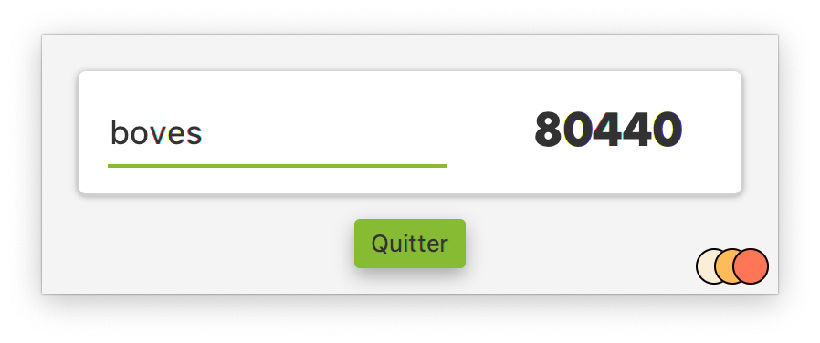

# chercheCP

Petit logiciel en JavaFX pour retrouver le code postal avec le nom de la ville en se basant sur le fichier csv de la poste
https://www.data.gouv.fr/fr/datasets/r/554590ab-ae62-40ac-8353-ee75162c05ee

Le fichier csv est intégré aux sources

On peut entrer le nom des villes sans respecter la casse ni se préoccuper des accents.

Pour l'aspect Material Design ce projet utilise le framework jfoenix

Ce projet va être mis à jour pour le jdk13 et openjfx13 dans une nouvelle branche...
