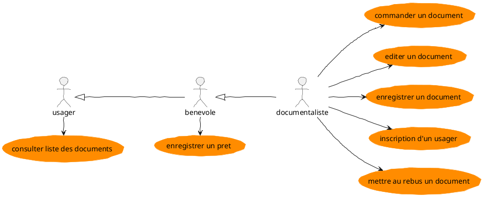
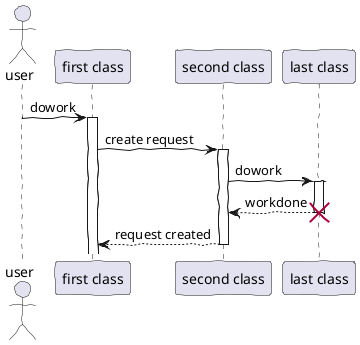

# chercheCP

Petit logiciel en JavaFX pour retrouver le code postal avec le nom de la ville en se basant sur le fichier csv de la poste
https://www.data.gouv.fr/fr/datasets/r/554590ab-ae62-40ac-8353-ee75162c05ee

Le fichier csv est intégré aux sources

On peut entrez le nom des villes sans respecter la casse ni se préoccuper des accents.

# test de plantuml dans un markdown

!!! info
	esstjjkhkljhljkh

## Pour les séquences

* [ ] 

